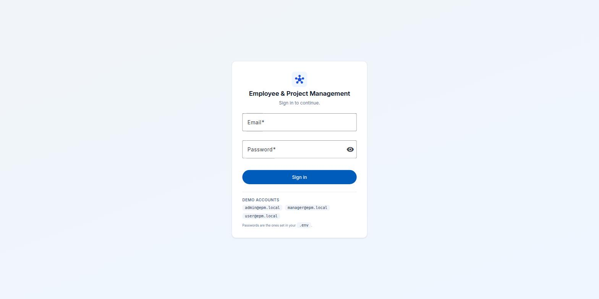
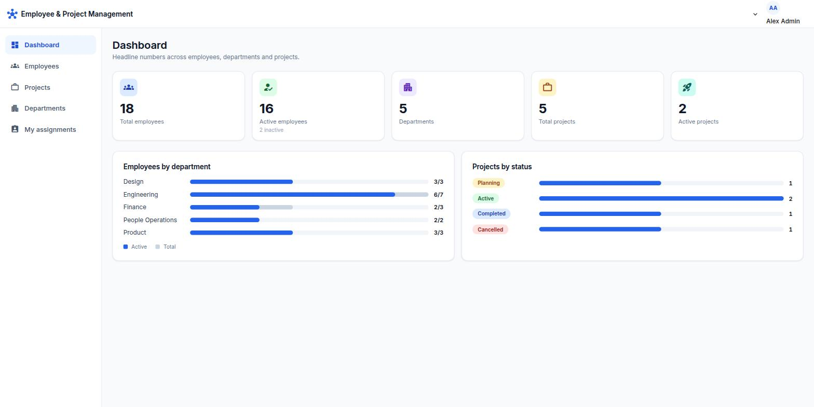
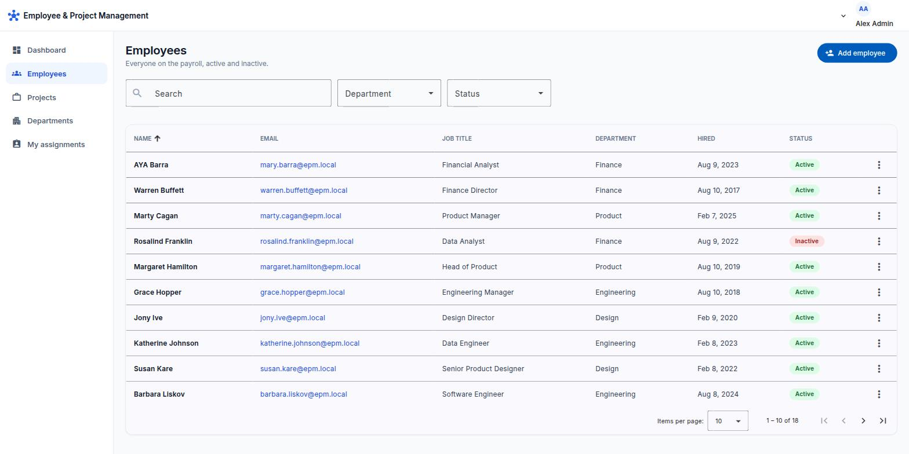
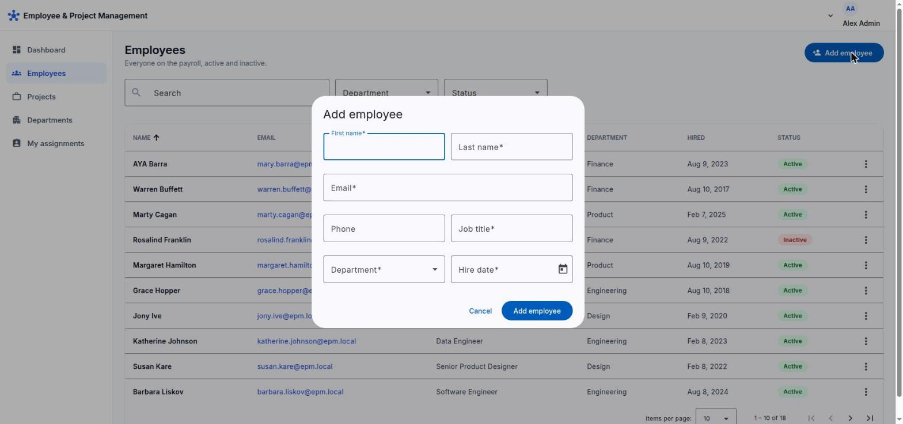
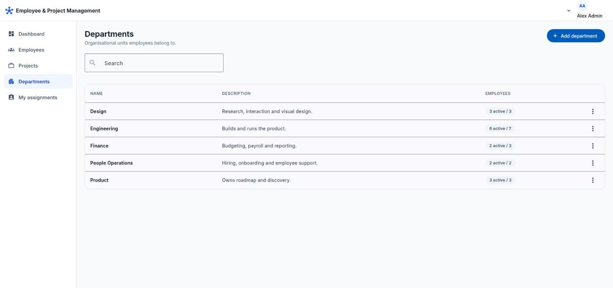
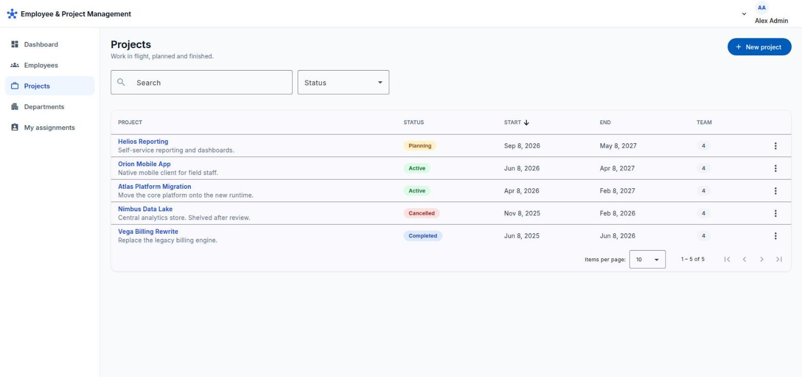
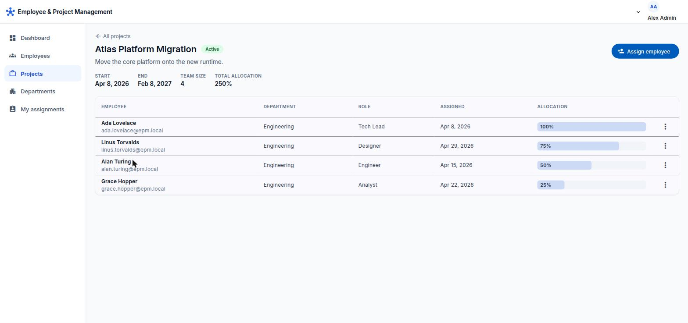
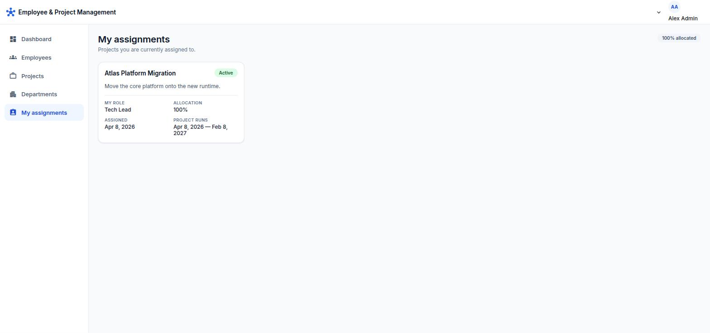
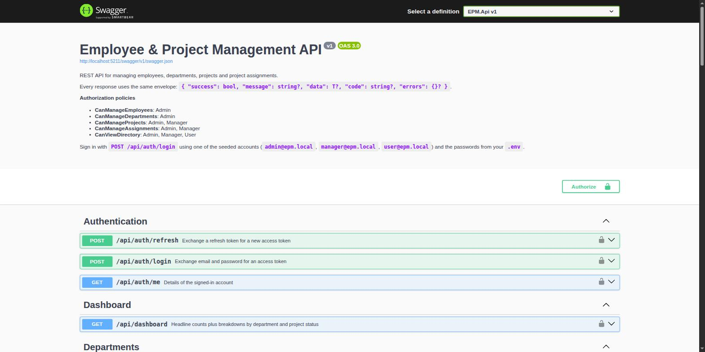

# Employee & Project Management System

A web application for managing employees, departments, projects and project assignments.

ASP.NET Core 8 Web API with Entity Framework Core and SQL Server, an Angular 19 single-page
client, JWT authentication with three roles, optional Microsoft Entra ID single sign-on, and
Swagger documentation. The backend is organised as **vertical slices** over a **domain-driven**
core.

---

## Contents

- [Technologies](#technologies)
- [Architecture](#architecture)
- [Features](#features)
- [Screens](#screens)
- [Database structure](#database-structure)
- [Setup](#setup)
- [Ports](#ports)
- [Configuration](#configuration)
- [Migrations](#migrations)
- [Running the backend](#running-the-backend)
- [Running the frontend](#running-the-frontend)
- [Authentication and authorization](#authentication-and-authorization)
- [Single sign-on with Entra ID](#single-sign-on-with-entra-id)
- [API documentation](#api-documentation)
- [Testing](#testing)
- [Assumptions](#assumptions)
- [Possible future improvements](#possible-future-improvements)

---

## Technologies

| Area | Choice |
|---|---|
| Backend | ASP.NET Core 8, C# 12, minimal APIs |
| Data | Entity Framework Core 8, SQL Server 2022 |
| Messaging | MediatR 12 (pinned — v13 is commercially licensed) |
| Validation | FluentValidation 11 |
| Auth | JWT bearer, PBKDF2 password hashing, Microsoft.Identity.Web for Entra ID |
| Docs | Swashbuckle / OpenAPI |
| Frontend | Angular 19 (standalone components, signals), TypeScript, SCSS, Angular Material |
| Tests | xUnit, FluentAssertions, NSubstitute, Testcontainers |
| Infrastructure | Docker Compose |

**On dependencies.** The set is deliberately small. There is no AutoMapper — slices project
straight to their response records with LINQ `Select`, which also keeps the generated SQL
narrow. There is no generic repository — `DbContext` already is a unit of work and `DbSet`
already is a repository, so wrapping them again buys indirection and nothing else. Angular
Material earns its place by providing the sortable, paginated table, dialogs and snackbars;
all theming and layout is our own SCSS.

---

## Architecture

Four projects, with dependencies pointing inward. `EPM.Domain` references nothing at all.

```text
src/
├── EPM.Domain/           Aggregates, value objects, domain events, Result/Error. No packages.
├── EPM.Application/      One folder per use case. Depends on Domain.
├── EPM.Infrastructure/   EF Core, migrations, JWT, seeding. Depends on Application.
└── EPM.Api/              Host, middleware, Swagger, CORS. Depends on Infrastructure.
```

### Vertical slices

Code is grouped by **use case**, not by technical layer. Each slice owns its command or query,
its handler, its validator and its HTTP endpoint, in one folder:

```text
Features/Employees/CreateEmployee/
├── CreateEmployee.cs           Command + Validator + Handler
└── CreateEmployeeEndpoint.cs   The route
```

Changing "create an employee" touches one folder instead of five. Adding a feature means adding
a folder — nothing central needs editing, so two people adding endpoints in the same sprint
never collide in the same file.

**There is no `Controllers/` folder.** Each slice declares a minimal-API endpoint by
implementing `IEndpoint`; startup scans the Application assembly and maps them all
(`EndpointExtensions.MapEndpoints`). The routes match the specification exactly — see
[API documentation](#api-documentation). This is the one deliberate departure from the sample
layout in the brief, which describes a horizontal `Controllers / Services / DTOs` split; the
brief calls that "a possible structure", and co-locating the route with its handler is the
entire point of the style.

### Domain-driven design

Business rules live inside the aggregates, not in service classes.

**`Project` is the aggregate root that owns `ProjectAssignment`.** This is the central
modelling decision. Every assignment rule — no duplicate employee, allocation 1–100, dates
inside the project schedule — needs to compare a candidate against the *other* assignments and
against the project's own dates. Putting the collection behind this root means all of them are
checked in one place, on data the root already has loaded, and no caller can bypass them by
inserting into a join table directly.

The one rule the root cannot check itself is "the employee must be active", because that lives
in a different aggregate. Rather than reach across, the root asks for the answer as a
parameter:

```csharp
public Result AssignEmployee(
    int employeeId, bool employeeIsActive, string? role,
    DateOnly assignedDate, int allocationPercentage)
```

The calling handler loads the employee and supplies `IsActive`. The two aggregates stay
independent.

**Value objects** — `Email`, `PhoneNumber`, `DateRange`, `Allocation`. Each has a private
constructor and a static `Create` returning `Result<T>`, so an invalid instance cannot exist.
`Allocation` is what makes the 1–100 rule checked exactly once, at construction, instead of at
every use site.

**`Result<T>` instead of exceptions.** An expected refusal ("email already taken", "project not
found") returns a failed `Result`; only bugs and infrastructure faults throw. That keeps
exceptions meaning "bug or outage", and keeps the happy path readable — a duplicate email is
not exceptional, it is Tuesday. `Error.Type` is mapped to an HTTP status in exactly one place
(`ResultExtensions`), so handlers never mention status codes.

**Domain events** — collected on `AggregateRoot`, dispatched by a `SaveChangesInterceptor`
*after* the save commits. `EmployeeDeactivated` is handled by removing that employee from every
project they were still assigned to. Without it, "inactive employees cannot be assigned" would
only be half enforced: new assignments blocked, but existing allocations left holding capacity
for someone who no longer works here.

### Rules that are not aggregate invariants

Email uniqueness, department-name uniqueness and "a department with active employees cannot be
deleted" all span more than one row, so an aggregate cannot see enough to enforce them. Each is
implemented as a **unique index or FK constraint** (the guarantee) **plus a pre-check in the
handler** (the readable message). The pre-check and the insert are not atomic; if two requests
race, the second fails at the database, which is the correct outcome.

---

## Features

- **Employees** — CRUD with soft deletion (deactivate/reactivate), server-side search,
  filtering by department and status, sorting on seven columns, and paging.
- **Departments** — CRUD, unique names, delete blocked while employees remain.
- **Projects** — CRUD with four statuses, open-ended projects (no end date), server-side
  search, status filter, sorting and paging.
- **Project assignments** — assign, update role/allocation, remove; team view per project;
  "my assignments" scoped to the caller's own token.
- **Dashboard** — five headline counts plus employees-by-department and projects-by-status
  breakdowns, all aggregated in SQL.
- **Auth** — JWT with refresh-token rotation, three roles, policy-based authorization enforced
  per endpoint. Optional Entra ID SSO.
- **Errors** — one response envelope for every outcome, with field-keyed validation messages
  that the Angular forms attach to the matching control.

---

## Screens

All shots are from the seeded demo data, signed in as `admin@epm.local` — the Admin role is
the only one that sees every screen below.

### Sign in

Email and password against the local account store. The three seeded accounts are listed on
the card itself; their passwords come from your `.env`, never from this repository.



### Dashboard

Five headline counts across the top, then employees-by-department and projects-by-status
breakdowns. Every number is aggregated in SQL rather than counted in memory.



### Employees

Server-side search, department and status filters, sortable columns and paging — the grid
holds 18 seeded employees, two of them soft-deleted and showing as *Inactive*. The row menu
covers edit, deactivate and reactivate.



### Employee form

Add and edit run through the same dialog. Required fields are marked, and validation errors
returned by the API are attached back onto the matching control.



### Departments

Admin-only, matching the API's `CanManageDepartments` policy. The employee count per
department is shown as active-over-total; deletion is blocked while any employee remains.



### Projects

The four project statuses — Planning, Active, Completed, Cancelled — with search, status
filter, sorting and team size per row.



### Project detail and assignments

The team for one project, each member with a role and an allocation percentage. Total
allocation is summed across the team, so over-commitment is visible at a glance.



### My assignments

The projects the signed-in user is assigned to, scoped from their own token rather than a
route parameter — available to every role.



### API documentation

Swagger UI, grouped by feature, with the authorization policies documented in the header and
a lock icon on every endpoint that requires a token.



---

## Database structure

```text
Departments ──1──────*── Employees ──1────*── ProjectAssignments *────1── Projects
                          │
                          └──0..1── Users ──1────*── RefreshTokens
```

| Table | Key constraints and indexes |
|---|---|
| `Departments` | `UX_Departments_Name` unique |
| `Employees` | `UX_Employees_Email` unique; FK → Departments (**Restrict**); `IX_Employees_Department_IsActive`; `IX_Employees_Name` |
| `Projects` | `UX_Projects_Name` unique; `IX_Projects_Status`; `IX_Projects_StartDate`. Schedule is an owned type → `StartDate` / nullable `EndDate` columns |
| `ProjectAssignments` | `UX_ProjectAssignments_Project_Employee` unique (the database backstop for "no duplicate assignment"); `CK_ProjectAssignments_AllocationPercentage BETWEEN 1 AND 100`; FK → Projects (**Cascade**), FK → Employees (**Restrict**) |
| `Users` | `UX_Users_Email` unique; `UX_Users_ExternalObjectId` unique **filtered** on `IS NOT NULL`; nullable `EmployeeId` |
| `RefreshTokens` | `UX_RefreshTokens_Token` unique; FK → Users (**Cascade**) |

**Delete behaviour is deliberate.** Restrict from Employees so a department can never quietly
take people with it, and so an employee is never removed by a cascade — employees are
deactivated, not deleted. Cascade from Projects because an assignment to a project that no
longer exists is meaningless.

**Soft delete without a global query filter.** `Employee.IsActive` is an ordinary column. A
global filter would hide inactive employees everywhere and force `IgnoreQueryFilters()` at
nearly every call site — the employees page has an explicit status filter and the dashboard
reports total *versus* active, so both need to see them. Each query says what it wants.

**Value objects and EF mapping.** `Email` and `Allocation` are mapped as **owned types**, not
value converters. A converter makes the column opaque to the query translator: EF will
client-evaluate `.Value` in a final projection, but `ORDER BY` and `WHERE` must run on the
server, and both columns are searched or sorted. `PhoneNumber` stays value-converted because it
is optional and nothing queries it.

---

## Setup

### Prerequisites

- Docker with Compose
- .NET 8 SDK (only if running the API outside Docker)

Node.js is **not** required on the host — the frontend runs in a `node:20-alpine` container.

### Quick start

```bash
cp .env.example .env          # then edit — see below
docker compose up
```

Open <http://localhost:4211> and sign in as `admin@epm.local` with the password from your
`.env`. Migrations are applied and demo data seeded automatically on first run.

Before starting, generate a real signing key and put it in `.env`:

```bash
openssl rand -base64 48       # paste as JWT_KEY
```

`MSSQL_SA_PASSWORD` must satisfy SQL Server's complexity policy (8+ characters, upper, lower,
digit and symbol) or the container exits on boot.

---

## Ports

Everything is off the framework defaults so this stack can run alongside other projects.

| Service | Host port |
|---|---|
| Angular dev server | **4211** |
| API (HTTP) | **5211** |
| API (HTTPS, local only) | **5212** |
| SQL Server | **14330** |

Ports are declared in `docker-compose.yml` and `src/EPM.Api/Properties/launchSettings.json`
only. The Angular dev server proxies `/api` to the backend (`client/proxy.conf.js`), so the SPA
makes same-origin calls and CORS is only relevant when running the API outside Docker.

---

## Configuration

Nothing environment-specific is hardcoded. `appsettings.json` is committed but contains
**placeholders only**; real values come from environment variables (Docker) or user-secrets
(local development). `.env` is gitignored.

| Key | Purpose |
|---|---|
| `ConnectionStrings:Default` | SQL Server connection string |
| `Jwt:Key` | HMAC-SHA256 signing key — **32 characters minimum**, validated at startup |
| `Jwt:Issuer`, `Jwt:Audience` | Token issuer and audience |
| `Jwt:AccessTokenMinutes`, `Jwt:RefreshTokenDays` | Token lifetimes |
| `EntraId:*` | See [Single sign-on](#single-sign-on-with-entra-id) |
| `Cors:AllowedOrigins` | Explicit origin list — never `*` |
| `Seed:Enabled`, `Seed:*Password` | Demo data. No default passwords: if unset, login accounts are not created and the log says so |

Options are bound with `ValidateDataAnnotations().ValidateOnStart()`, so a missing signing key
stops the application from booting rather than surfacing as a 500 on the first login.

Running the API on the host (rather than via Compose) needs these set once. Neither
`appsettings.json` nor `appsettings.Development.json` carries a connection string or a
password — both files are committed, so a credential in either is a credential in source
control.

```bash
cd src/EPM.Api
dotnet user-secrets set "ConnectionStrings:Default" \
  "Server=localhost,14330;Database=EmployeeProjectManagement;User Id=sa;Password=<your MSSQL_SA_PASSWORD>;TrustServerCertificate=True;MultipleActiveResultSets=True"
dotnet user-secrets set "Jwt:Key" "$(openssl rand -base64 48)"
dotnet user-secrets set "Seed:AdminPassword" "<choose one>"
dotnet user-secrets set "Seed:ManagerPassword" "<choose one>"
dotnet user-secrets set "Seed:UserPassword" "<choose one>"
```

None of the seed passwords has a default, in `SeedOptions` or in `docker-compose.yml`. A
fallback value would mean an admin account whose password is published in this repository
whenever the variable is missing. If they are unset the login accounts are simply not created,
and the startup log says so.

---

## Migrations

Migrations live in `EPM.Infrastructure/Persistence/Migrations`. A
`DesignTimeDbContextFactory` lets the EF tooling build a context without booting the API, so
generating a migration needs no running database or configured secrets.

```bash
dotnet tool install --global dotnet-ef            # once

# Add a migration
dotnet ef migrations add <Name> -p src/EPM.Infrastructure -s src/EPM.Infrastructure \
  -o Persistence/Migrations

# Apply to a database
EPM_MIGRATIONS_CONNECTION="Server=localhost,14330;Database=EmployeeProjectManagement;User Id=sa;Password=<yours>;TrustServerCertificate=True" \
  dotnet ef database update -p src/EPM.Infrastructure -s src/EPM.Infrastructure

# Or produce a script for a release pipeline
dotnet ef migrations script -p src/EPM.Infrastructure -s src/EPM.Infrastructure -o migrate.sql
```

In **Development** the API migrates and seeds itself on startup, which is why `docker compose
up` just works. It deliberately does **not** do this in production: every instance would race
to apply the same schema change on deploy, and a failed migration would take the app down with
it. Production applies migrations as a separate release step.

---

## Running the backend

```bash
# With Docker (recommended) — configuration comes from .env, nothing else to set up
docker compose up -d sqlserver api

# Or on the host, against the compose SQL Server.
# Requires the user-secrets from Configuration above; the API refuses to start without them.
docker compose up -d sqlserver
dotnet run --project src/EPM.Api
```

Swagger UI: <http://localhost:5211/swagger>
Health check: <http://localhost:5211/health>

---

## Running the frontend

```bash
docker compose up web          # http://localhost:4211
```

The host has no Node requirement. To run it directly instead (needs Node 18+):

```bash
cd client
npm install
npm start
```

---

## Authentication and authorization

Sign in at `POST /api/auth/login` to receive an access token and a refresh token. The refresh
token is **rotated** on every use — the presented one is revoked and replaced, so each works
exactly once and a stolen token stops working as soon as the legitimate client refreshes.

Passwords are hashed with PBKDF2-HMAC-SHA256 at 210,000 iterations (OWASP's floor), in the same
storage format ASP.NET Core Identity uses. A login attempt for an unknown address still
performs a hash comparison against a dummy value, so "no such user" cannot be distinguished
from "wrong password" by timing.

### Role matrix

Authorization is **policy-based**, enforced per endpoint. Endpoints ask for a capability, not a
role, so the matrix changes in one place (`Policies.RolesByPolicy`) rather than across every
endpoint — and the Swagger description is generated from that same table, so the docs cannot
drift from the rules.

| Policy | Admin | Manager | User |
|---|:---:|:---:|:---:|
| `CanViewDirectory` (all reads) | ✅ | ✅ | ✅ |
| `CanManageProjects` | ✅ | ✅ | — |
| `CanManageAssignments` | ✅ | ✅ | — |
| `CanManageEmployees` | ✅ | — | — |
| `CanManageDepartments` | ✅ | — | — |

`GET /api/me/assignments` takes no employee id — the server reads it from the token, which is
what makes "a User can view *their* assignments" enforceable rather than advisory.

The Angular client hides controls a role cannot use, but that is a convenience only. The API
enforces the same matrix, and a hidden button is still callable with curl.

### Seeded accounts

`admin@epm.local`, `manager@epm.local`, `user@epm.local` — passwords from your `.env`.

---

## Single sign-on with Entra ID

Implemented and **disabled by default**, so the application runs and every test passes with no
Azure tenant.

### Configuration

| Key | Value |
|---|---|
| `EntraId:Enabled` | `true` to register the scheme |
| `EntraId:Instance` | `https://login.microsoftonline.com/` (differs in sovereign clouds) |
| `EntraId:TenantId` | Directory (tenant) ID from the app registration |
| `EntraId:ClientId` | Application (client) ID |
| `EntraId:Audience` | Usually the client ID; `api://{clientId}` when tokens are requested against an Application ID URI |
| `EntraId:DefaultRole` | Role for a first-time SSO user carrying no recognised app role. Defaults to the least-privileged `User` |

Startup validates that `Enabled` implies `TenantId` and `ClientId` are both set, so a
half-filled configuration fails loudly instead of producing a scheme that rejects every token.

### Identity provider setup

1. Register an application in Entra ID → **App registrations → New registration**.
2. Expose an API and set the Application ID URI, or use the client ID as the audience.
3. Under **App roles**, declare three roles with the values `EPM.Admin`, `EPM.Manager` and
   `EPM.User`, each with member type *Users/Groups*.
4. Assign users to those roles under **Enterprise applications → Users and groups**.
5. For the SPA, add a **Single-page application** platform with redirect URI
   `http://localhost:4211` and enable the authorization code flow with PKCE.

### Authentication flow

1. The SPA redirects the user to Entra ID (authorization code + PKCE).
2. Entra returns an access token whose `roles` claim carries the assigned app roles.
3. The API's **policy scheme** inspects the token's `iss` claim and forwards it to whichever
   bearer handler can validate it — local or Entra. This is what lets both token types work
   against the same endpoints without every endpoint naming a scheme. Reading the issuer is not
   trusting it: the worst a forged `iss` achieves is being sent to a handler that rejects it.
4. `EntraIdClaimsTransformation` runs after validation. It maps the app roles onto the local
   role enum (most privileged wins), and **just-in-time provisions** a `Users` row keyed on the
   stable `oid` claim — linking to an existing local account by email if one exists, so a person
   who already had a password does not end up with two identities.
5. From that point an SSO user carries the same `uid`, `role` and `eid` claims as a local one,
   and resolves through the identical authorization model.

While SSO is enabled, Entra is the source of truth for a user's role: a change in the directory
takes effect on their next sign-in.

### How SSO is verified

`EntraIdSsoTests` — **19 tests** — runs the whole path against a locally hosted OpenID Connect
issuer (`FakeEntraIdServer`), which serves a real discovery document and JWKS and signs tokens
with RSA. Nothing in the application is stubbed: the API performs its real discovery fetch,
downloads the signing keys, and validates signature, issuer, audience and lifetime before the
claims transformation runs.

| Verified | |
|---|---|
| Token acceptance | valid token accepted; **forged signature**, **wrong audience**, **foreign issuer** and **expired** tokens each rejected |
| JIT provisioning | first sign-in creates a local account keyed on `oid`, with no password |
| Idempotency | signing in twice does not create a second account |
| Account linking | an existing password account is linked, not duplicated |
| Role mapping | each app role maps to its local role; **most privileged wins** when several are assigned |
| Role sync | a role changed in the directory takes effect on the next sign-in |
| Authorization parity | an SSO Admin can do what a local Admin can; an SSO User is refused the same things |
| Scheme coexistence | local password login still works while SSO is enabled |
| Revocation | a deactivated account loses access even holding a valid token |

Two deliberate concessions, both narrow, both documented in `EntraIdApiFactory`:

- `RequireHttpsMetadata = false`, because the test issuer is on a loopback HTTP port. This
  relaxes transport security only; token validation is untouched.
- `AadIssuerValidator` is replaced with an exact-match issuer check. It encodes the shape of
  real Microsoft authorities and cannot pass for a loopback issuer by design. The security
  property is preserved rather than waived — `A_token_from_an_unexpected_issuer_is_rejected`
  proves a wrong issuer is still refused.

**What remains unverified**, because it is not code in this repository: Microsoft's own token
issuance, the interactive sign-in UI, and the app-registration settings in the Azure portal.

Two real findings came out of writing these tests:

1. **`EntraId:*` must be supplied by a configuration source present when the host is built** —
   environment variables or `appsettings`. Whether a scheme exists is decided once at
   registration, so configuration layered on later is read too late and the scheme is silently
   never registered. This is exactly how `docker-compose.yml` supplies it.
2. **`EntraId:DefaultRole` cannot rescue a token carrying neither `scp` nor `roles`.**
   Microsoft.Identity.Web rejects those with a 401 before any application code runs. The
   fallback applies to a delegated token that has a scope but no recognised app role — a
   signed-in user never assigned one.

---

## API documentation

Swagger UI at <http://localhost:5211/swagger> — 14 routes, with an **Authorize** button.
Paste the `accessToken` from a login response; the `Bearer` prefix is added for you.

```http
POST   /api/auth/login
POST   /api/auth/refresh
GET    /api/auth/me

GET    /api/employees                   ?page&pageSize&search&sortBy&sortDescending
                                        &departmentId&isActive&hiredFrom&hiredTo
GET    /api/employees/{id}
POST   /api/employees
PUT    /api/employees/{id}
DELETE /api/employees/{id}              deactivates (soft delete)
POST   /api/employees/{id}/reactivate

GET    /api/departments
GET    /api/departments/{id}
POST   /api/departments
PUT    /api/departments/{id}
DELETE /api/departments/{id}

GET    /api/projects                    ?page&pageSize&search&sortBy&sortDescending
                                        &status&startsFrom&startsTo&employeeId
GET    /api/projects/{id}
POST   /api/projects
PUT    /api/projects/{id}
DELETE /api/projects/{id}

GET    /api/projects/{projectId}/employees
POST   /api/projects/{projectId}/employees
PUT    /api/projects/{projectId}/employees/{employeeId}
DELETE /api/projects/{projectId}/employees/{employeeId}

GET    /api/me/assignments
GET    /api/dashboard
```

### Response envelope

Every endpoint answers in the same shape, so the client handles errors in one place.

```jsonc
// Success
{ "success": true, "data": { "id": 1, "fullName": "Ada Lovelace" } }

// Business failure — 409
{ "success": false, "message": "Employee email already exists.", "code": "Employee.EmailExists" }

// Validation failure — 400
{
  "success": false,
  "message": "One or more validation errors occurred.",
  "code": "Validation.Failed",
  "errors": {
    "email":    ["Email must be a valid email address."],
    "hireDate": ["Hire date cannot be in the future."]
  }
}
```

`code` is stable and machine-readable; `message` is what a person reads and may change freely.
The `errors` keys are camelCased to match the submitted JSON, which is what lets the Angular
forms attach each message to the right control.

Status codes: `400` validation, `401` unauthenticated, `403` wrong role, `404` missing,
`409` conflict with current state, `500` unexpected (logged in full, never detailed to the
caller).

---

## Testing

**182 tests**, all passing.

```bash
dotnet test                                    # everything
dotnet test tests/EPM.Domain.UnitTests         # 89 — no infrastructure needed
dotnet test tests/EPM.Application.UnitTests    # 38 — SQLite in-memory
dotnet test tests/EPM.Api.IntegrationTests     # 55 — needs Docker running
```

| Project | Count | What it covers |
|---|---:|---|
| `EPM.Domain.UnitTests` | 89 | Aggregate invariants and value objects, in isolation |
| `EPM.Application.UnitTests` | 38 | Handlers against SQLite with the real EF model |
| `EPM.Api.IntegrationTests` | 55 | Real HTTP against real SQL Server via Testcontainers, including 19 Entra ID SSO tests against a locally hosted OIDC issuer |

Every case the brief names explicitly is covered at more than one level:

| Required case | Domain | Application | API |
|---|:---:|:---:|:---:|
| Creating an employee succeeds | ✅ | ✅ | ✅ |
| Duplicate employee emails prevented | — | ✅ | ✅ |
| Invalid department assignment prevented | ✅ | ✅ | ✅ |
| Future hire dates prevented | ✅ | ✅ | ✅ |
| Inactive employees cannot be assigned | ✅ | ✅ | ✅ |
| Duplicate project assignments prevented | ✅ | ✅ | ✅ |

**Why SQLite and not the InMemory provider.** InMemory is a dictionary: it ignores unique
indexes, foreign keys and check constraints, so a test for "duplicate email is rejected" would
pass whether or not the constraint exists. SQLite runs the real model and enforces them.

**Why Testcontainers for the API tests.** They exist to catch what only the production engine
can tell you: whether the migrations actually apply, whether a filtered unique index is valid
T-SQL, whether a LINQ query translates. Two real bugs were caught exactly this way — `Email`
and `Allocation` were originally value-converted, which made searching and sorting on them
untranslatable at runtime while every in-memory test passed.

---

## Assumptions

- **Employees and login accounts are separate.** Most employees never need portal access, and
  some accounts (a service admin) have no employee record. `Users.EmployeeId` is the optional
  bridge, and it is what `GET /api/me/assignments` keys off — an account without one correctly
  sees an empty list rather than an error.
- **`DELETE /api/employees/{id}` deactivates.** The route is DELETE because the brief's REST
  table asks for it; the behaviour is soft deletion because the same brief prefers it, and
  historical assignments would be lost otherwise. `POST .../reactivate` is the way back — soft
  deletion with no undo is a trap.
- **Projects are hard-deleted.** Nothing references a project the way assignments reference an
  employee, and its assignments cascade away with it. The `Cancelled` status exists for a
  project that should stay on the books.
- **Deactivating an employee unassigns them from every project.** Otherwise their allocation
  stays booked against capacity nobody can see or reclaim.
- **Shrinking a project's schedule under existing assignments is refused**, rather than silently
  leaving assignments outside the range the assignment rule enforces.
- **One role per user.** The three tiers are strictly widening, so a many-to-many table would
  add a join for no behaviour we need. If overlapping roles ever appear, only the token service
  and the policies change.
- **A single light theme.** The design tokens have no dark variants, and the Material theme is
  pinned to light to match — mixing the two leaves Material-owned surfaces dark while everything
  else stays light.
- **Dates are calendar facts, not instants.** Hire dates and project dates use `DateOnly` with
  no timezone. The client formats them from local date parts rather than `toISOString()`, which
  would shift a date picked west of Greenwich by a day.
- **Tokens are stored in `localStorage`.** It survives a refresh and a new tab, which is what
  people expect, at the cost of being readable by any script on the page. See below.

## Possible future improvements

- **Move the refresh token to an httpOnly, SameSite cookie** and keep the access token in
  memory. This is the main security trade currently outstanding: it removes the XSS exposure of
  `localStorage` at the cost of CSRF handling and a more involved local setup.
- **Transactional outbox for domain events.** Events are currently published after the save
  commits and handlers run in their own transaction. The follow-up work is idempotent so a
  retry is free, but a system needing stricter guarantees would write events to an outbox table
  inside the same transaction.
- **Full-text search.** `Contains` translates to `LIKE '%term%'`, which cannot use an index.
  Fine at this scale; a table in the millions wants SQL Server full-text search.
- **Frontend unit tests.** The Angular app has no Jasmine specs. The highest-value targets are
  the auth interceptor's refresh queue and the `applyFieldErrors` mapping.
- **Optimistic concurrency.** A `rowversion` column would stop two admins silently overwriting
  each other's edits to the same employee.
- **Generated API client.** The TypeScript models are hand-written mirrors of the contracts. At
  a larger size, generating them from `/swagger/v1/swagger.json` removes a class of drift.
- **Audit trail.** Who changed what and when — the aggregates already raise domain events, so
  the hook exists.
- **Add the MSAL redirect flow to the SPA login page**, behind the existing configuration
  flag. The API side of SSO is verified (see [Single sign-on](#single-sign-on-with-entra-id));
  the browser-side sign-in button is not yet wired up.
- **Confirm against a live tenant.** The protocol is verified locally, but Microsoft's own
  token issuance and the portal app-registration settings can only be exercised with a real
  subscription.
